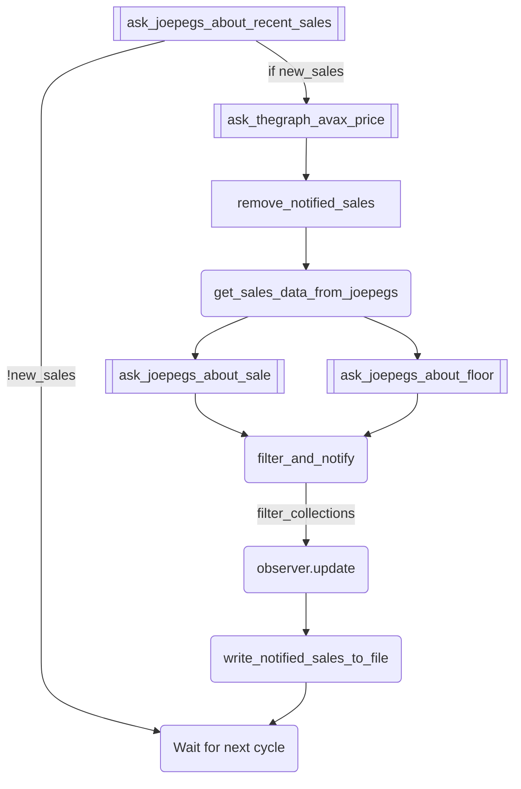

# NFT Sales Bot

Bot to notify you and your community about NFT sales on Joepegs.com!  


<!-- TABLE OF CONTENTS -->
## Table of Contents
1. [About The Project](#about-the-project)
2. [SECURITY](#security)
3. [Getting Started](#getting-started)
    * [Prerequisites](#prerequisites)
    * [Local installation](#local-installation)
    * [Cloud installation](#cloud-installation)
    * [Other ways](#other-ways)
    * [Configuration](#configuration)
4. [Flowchart](#flowchart)
5. [TODOs](#todos)
6. [Contributing](#contributing)
7. [License](#license)
8. [Contact](#contact)


## About The Project

Welcome to NFT Sales Bot v2.

This README and bot is meant to be easy and straightforward to use for everyone. If you have any questions or problems, feel free to DM me.

Code wasn't reviewed and isn't deployed in production right now. 

This bot enables notifying about recent sales on Joepegs marketplace on Avalanche. Relies heavily on Joepegs Open API and doesn't require any on-chain interaction.

Currently supports Discord webhook.

Would love any feedback, insights or critique.

Have fun!


[Back to top](#nft-sales-bot)


### Built With

* [Joepegs API](https://joepegs.dev/)
* [python-discord-webhook](https://pypi.org/project/discord-webhook/)
* [asyncio](https://docs.python.org/3/library/asyncio.html)/[httpx](https://www.python-httpx.org/)
* [Mermaid flowchart](https://mermaid-js.github.io/mermaid/#/README)


[Back to top](#nft-sales-bot)


## SECURITY

SECURITY IS VERY IMPORTANT IMPORTANT IN WEB3

Storing credentials in plain text file poses great threat to you/your community security. Anyone with access to your hosting service account, computer or console will be able to use them to send arbitrary messages and trick your community into phishing sites, which [happens](https://twitter.com/calvinbecerra/status/1454328591202721796) sometimes [(a lot actually)](https://twitter.com/zachxbt/status/1509749367363842075) and [discord hacks](https://twitter.com/zachxbt/status/1509766379456671752) play a significant role too. 

Accidentally uploading your webhook somewhere will have similiar effect.

There are a lot of resources in web about securing your accounts, for example [OpSec SelfGuard RoadMap](https://github.com/OffcierCia/Crypto-OpSec-SelfGuard-RoadMap) by Officer CIA.

[Back to top](#nft-sales-bot)

# Getting Started


## Prerequisites

1. Acquire your API key for Joepegs Public API [here](https://joepegs.dev/)
2. Acquire Discord webhook for a channel of your choosing. [Discord official guide](https://support.discord.com/hc/en-us/articles/228383668-Intro-to-Webhooks)
3. Python installed locally or in cloud
4. Not being overly scared by console

[Back to top](#nft-sales-bot)


### Local installation
Use source code editor like [Visual Studio Code](https://code.visualstudio.com/) with Python interpreter installed or [PyCharm](https://www.jetbrains.com/pycharm/)

1. Clone the repo
   ```sh
   git clone https://github.com/pecio222/nft-sales-bot.git
   ```
2. Change current directory (cd) to folder where github repository was cloned:
    ```sh
    cd nft-sales-bot
    ```
3. Install dependencies
   ```sh
   pip install -r requirements.txt
   ```
4. Rename `.env copy` to `.env` and enter your credentials. Remember to be cautious with your authentication tokens.
   ```
   DISCORD_TEST_URL="https://discord.com/api/webhooks/..."
   JOEPEGS_API_KEY="123abc..."  
   ```
5. Configure `config.json` to your preferences according to <a href="#configuration">Configuration</a>

6. Run the program
    ```sh
   python .\main.py
   ```

[Back to top](#nft-sales-bot)

## Cloud installation


Cloud installation enables you to leave this working 24/7.
In this section pythonanywhere.com will be used.
**Paid membership recommended** (cheapest and good enough option: $5/month + taxes)


1. Create account, confirm email
2. Go to Dashboard -> open Bash Console
3. In Bash Console:

Clone github repository into pythonanywhere:
```sh
git clone https://github.com/pecio222/nft-sales-bot.git
```
Create virtual environment:
```sh
mkvirtualenv myvirtualenv --python=/usr/bin/python3.9
```
Change current directory (cd) to folder where github repository was cloned:
```sh
cd nft-sales-bot
```
Install dependencies:
```sh
pip install -r requirements.txt
```
4. Go to files/nft-sales-bot/.env copy (through menu on upper right or link) (https://www.pythonanywhere.com/user/{your_username}/files/home/{your_username}/nft-sales-bot) and paste your credentials into `.env copy`. **Do not save** - *save as* `.env`

5. Go to files/nft-sales-bot/config.json and configure your bot according to <a href="#configuration">Configuration</a>


For first startup private/throwaway account recommended for testing.\
Also, upon first startup bot will spit out a lot of recent sales, as lastNotifiedTransactions.json file will be empty.

6. Run the program.
```sh
python main.py
```

7. Voila! It works! Observe NFTs being sold now.

8. To make sure this task runs 24/7 without breaks, go to Task tab and in Always-on tasks paste:

```
python3.9 /home/<your username>/nft-sales-bot/main.py
```


If above looks confusing at first - for visual, very easy and straightforward setup tutorial watch [Charming Data's tutorial 12:26 to 16:00](https://youtu.be/WOWVat5BgM4?t=745) without "web app" part, we don't use it here.


On free account you might get ```OSError: Tunnel connection failed: 403 Forbidden```

## Other ways

Anything other that can run Python will suffice. You can try Raspberry Pi, your local computer, even Android phone maybe. Only problem is keeping it up 24/7.

You can also use any other cloud service to host this script, like [Heroku](https://devcenter.heroku.com/categories/python-support) or [other ones](https://www.pythondiscord.com/pages/guides/python-guides/vps-services/).


[Back to top](#nft-sales-bot)

<!-- CONFIGURATION -->
## Configuration

### config.json

Bot configuration is stored in `config.json` file. Edit it to change parameters.

**general**

`recentSalesAmount` - Choose how many recent transactions to fetch from Joepegs API in every run. Bot stores recentSalesAmount * 2 transactions in lastNotifiedTransactions.json to avoid repeating notifications. 30-50 works just fine.

`salesCallIntervalSeconds` - How often bot should fetch data. 60 seconds works just fine.

`oldestSaleToNotify` - How old should be last sale, that bot should notify about, in seconds.

**channels**

You can add any amount of channels/webhooks that you want here.\
`turnedOn` - decide if bot should send notifications to this Discord [true/false].

`envWebhookName` - if using .env file to store webhook URL, insert variable name here [not an actual webhook].

`discordBotName` - choose bot name.

`filter` - decide if all collections should be shown, or only chosen ones. Empty list means all collections are observed. Format - list of strings: 

`["collection address1", "collection address2", "collection address3", ...]` 

Can be lowercase or checksummed.


[Back to top](#nft-sales-bot)


<!-- FLOWCHARTS -->
## Flowchart

Simplified program flow.



[Back to top](#nft-sales-bot)


<!-- TODOs -->
## TODOs

1. Better handling of rate limiting. Isn't an issue for up to ~50 notifications at once now.
2. Handle sweeping (batch buys) better.
3. Migrate to discord.py for easy adding bot to any server without hosting.

Known bugs/smells to handle:

1. Discord not always accepts images/gifs/videos, even if they are properly sent.

See the [open issues](https://github.com/pecio222/nft-sales-bot/issues) for a full list of proposed features (and known issues).

[Back to top](#nft-sales-bot)


## License

Distributed under the MIT License.


## Contact

[Twitter - pecio222](https://twitter.com/pecio222)

[Discord - pecio33#5843](https://discord.com/users/pecio33#5843/)

[Project Link](https://github.com/pecio222/nft-sales-bot)

If you want to talk about this repo, DM me, would be happy to help or chat.

[Back to top](#nft-sales-bot)

